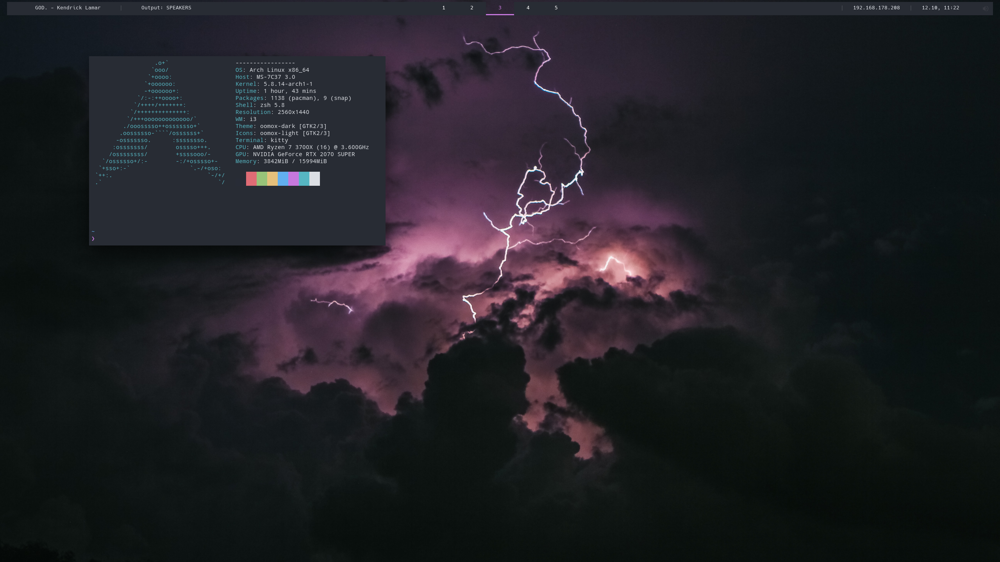
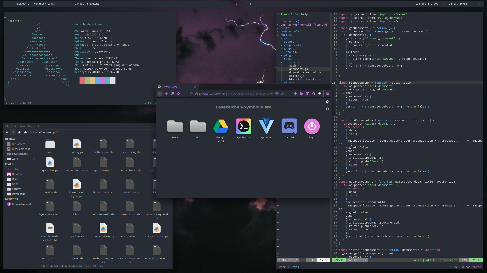
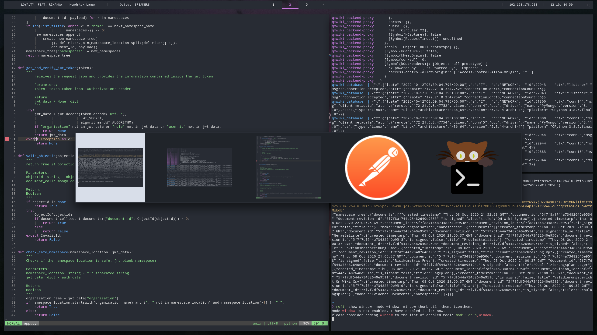

# dotfiles
These are my dotfiles I use on my arch installation.
Open issues for any questions!




## Scripts
### Create Paste
The script under scripts/create_paste.sh requires you to do two things:
 - Modify the script and replace URL variable with the path / url to your pastes
 - Create a ssh target with the name pastes, by creating said target in .ssh/config like:
```
Host pastes
    HostName mytarget.local
    Port 2442
    IdentityFile .ssh/identity_without_keyphrase
```
Now you are able to create pastes from your clipboard!
